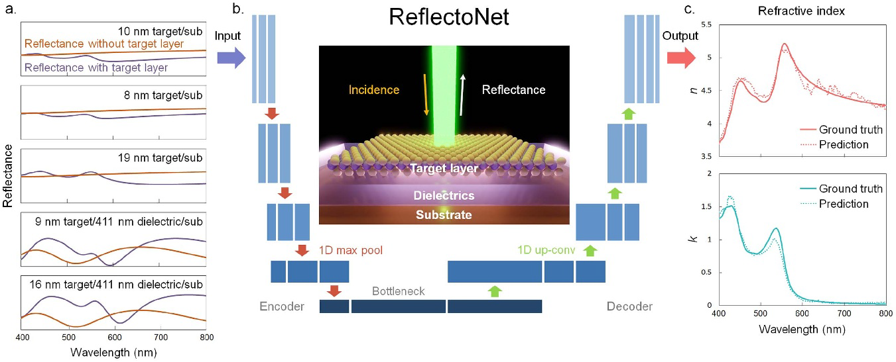

# Measuring complex refractive index through deeplearning-enabled optical reflectometry

A pytorch implementation for our [ReflectoNet](https://iopscience.iop.org/article/10.1088/2053-1583/acc59b/meta).

Ziyang Wang, Yuxuan Cosmi Lin, Kunyan Zhang, Wenjing Wu and Shengxi Huang

Abstract: Optical spectroscopy is indispensable for research and development in nanoscience and nanotechnology, microelectronics, energy, and advanced manufacturing. Advanced optical spectroscopy tools often require both specifically designed high-end instrumentation and intricate data analysis techniques. Beyond the common analytical tools, deep learning methods are well suited for interpreting high-dimensional and complicated spectroscopy data. They offer great opportunities to extract subtle and deep information about optical properties of materials with simpler optical setups, which would otherwise require sophisticated instrumentation. In this work, we propose a computational approach based on a conventional tabletop optical microscope and a deep learning model called ReflectoNet. Without any prior knowledge about the multilayer substrates, ReflectoNet can predict the complex refractive indices of thin films and 2D materials on top of these nontrivial substrates from experimentally measured optical reflectance spectra with high accuracies. This task was not feasible previously with traditional reflectometry or ellipsometry methods. Fundamental physical principles, such as the Kramers–Kronig relations, are spontaneously learned by the model without any further training. This approach enables in-operando optical characterization of functional materials and 2D materials within complex photonic structures or optoelectronic devices.


## Architecture

## Installation

Install dependencies

```bash
  pip install -r requirements.txt
```
    
## Running

```python
  modeltester.py
```


## Citation
If you find our work useful in your research, please cite our paper:
```
@article{wang2023measuring,
  title={Measuring complex refractive index through deep-learning-enabled optical reflectometry},
  author={Wang, Ziyang and Lin, Yuxuan Cosmi and Zhang, Kunyan and Wu, Wenjing and Huang, Shengxi},
  journal={2D Materials},
  volume={10},
  number={2},
  pages={025025},
  year={2023},
  publisher={IOP Publishing}
}
```